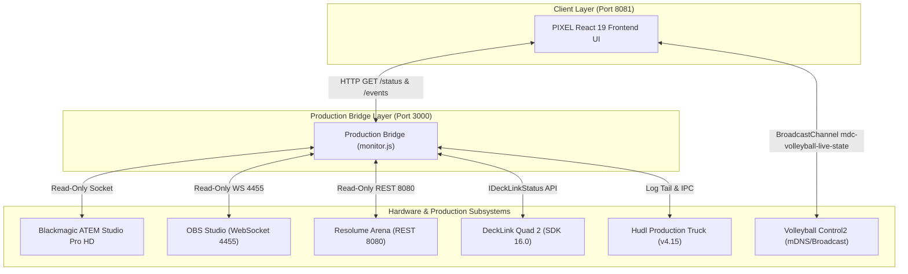

# PIXEL Production System Snapshot

**Date**: 2026-08-20  
**Current System Status**: Phase 0 through Phase 6.6 CLOSED (System Fully Operational)  
**Frontend Git Checkpoint**: `060b7db`  

---

## 1. System Purpose

PIXEL is a passive observability, multiviewer, and production intelligence platform designed specifically for live sports broadcasts. It provides real-time signal monitoring, tally visualization, event logging, and hardware health telemetry without interfering with active broadcast infrastructure.

---

## 2. Canonical Project Root

The official active project root for all development and runtime operations is located on the high-performance external volume:

```text
/Volumes/VGC-01/OBS Sports/PIXEL
```

### Unified Folder Structure:
- `frontend/`: Official React 19 / TypeScript / Vite PIXEL application.
- `production-bridge/`: Node.js Production Bridge API server.
- `diagnostics/`: Standalone browser diagnostic interface (`pixel.html`).
- `configs/`: Profile and physical signal mapping configurations (`setup.json`).
- `docs/`: Technical architectural maps and operational guides.

---

## 3. Architecture Diagram



---

## 4. Runtime Ports

| Port | Service | Protocol | Role |
| :--- | :--- | :--- | :--- |
| **3000** | Production Bridge API | HTTP / REST | Centralized normalized telemetry API |
| **8081** | PIXEL React UI | HTTP | Main broadcast director interface |
| **4455** | OBS WebSocket | WS 5.x | OBS Studio telemetry feed |
| **8080** | Resolume REST API | HTTP | Resolume Arena composition/layer feed |
| **1935** | Truck Internal RTMP | RTMP | Hudl Production Truck local render stream |

---

## 5. Startup Procedure

System startup is automated via:

```bash
/Volumes/VGC-01/OBS Sports/PIXEL/start-pixel.command
```

### Execution Sequence:
1. Identifies and clears any stale processes listening on ports `3000` and `8081`.
2. Spawns Production Bridge API daemon on port `3000`.
3. Spawns Python static server for compiled React UI on port `8081`.
4. Outputs live URLs (`http://127.0.0.1:8081/` and `http://127.0.0.1:3000/status`).

---

## 6. Shutdown Procedure

System shutdown is executed via:

```bash
/Volumes/VGC-01/OBS Sports/PIXEL/stop-pixel.command
```

### Safety Rules:
- **LISTEN-only Process Termination**: Uses `lsof -tiTCP:3000,8081 -sTCP:LISTEN` to terminate ONLY server listening sockets.
- **Browser Client Protection**: Never terminates established client connections or browser applications (Firefox, Comet, Chrome, Safari).

---

## 7. Subsystem Hardware Integrations

### ATEM Switcher
- **Model**: Blackmagic ATEM Television Studio Pro HD (IP `192.168.0.78`).
- **Telemetry**: Real-time Program (`pgm`) and Preview (`pvw`) input state.
- **Tally Behavior**: Automatic Red border for Program and Green border for Preview.
- **Mode**: STRICTLY READ ONLY.

### Blackmagic DeckLink Quad 2
- **Hardware**: DeckLink Quad 2 (8 SDI channels).
- **SDK**: Blackmagic Desktop Video SDK 16.0 (`IDeckLinkStatus` native helper).
- **Detection**: Passive signal lock, video format detection (`1080p59.94`), pixel format (`8-bit YUV 4:2:2`), and direction state (`CAPTURE`, `PLAYBACK`, `IDLE`).
- **Mapping Philosophy**: Physical connector mappings are configured in `setup.json` (`decklinkMapping`). Never infer `DeckLink Channel #` = `Cable #` = `ATEM Input #`.

### OBS Studio
- **Protocol**: OBS WebSocket v5 (port `4455`).
- **Telemetry**: Active Program scene, Preview scene, Studio Mode status, Recording status, Streaming status.
- **Reconnection**: Automatic 5-second non-blocking retry loop.
- **Mode**: STRICTLY READ ONLY.

### Resolume Arena
- **Protocol**: REST API v1 (`http://127.0.0.1:8080/api/v1`).
- **Telemetry**: Version (`Arena 7.20.1`), composition name (`Sports`), BPM (`120`), active column, active clip names per layer.
- **Deduplication**: Emit change events only on state modification.
- **Mode**: STRICTLY READ ONLY.

### Hudl Production Truck
- **Detection**: Process monitor (`Production Truck.app`) + active log tailer (`com.hudl.Production-Truck *.log`).
- **Confidence Model**:
  - `DIRECT`: Explicit log entry confirming action.
  - `INFERRED`: Derived from system file timestamps or render activity.
  - `UNKNOWN`: Default when ambiguous or during 10s log silence.
- **Safety Rule**: Replay readiness (`replayReady`) is NEVER assumed from video render activity (`outputPresent`).

### Volleyball Control2
- **Protocol**: Passive `BroadcastChannel` (`mdc-volleyball-live-state`).
- **Telemetry**: Live match score, set number, serving team, overlay visibility.

---

## 8. Frontend Architecture & Official Visual Rules

- **Framework**: React 19, TypeScript, Vite.
- **Store**: Zustand (`useSwitcherStore.ts`).

### Official Source Order Convention:
Across ALL multiviewer grids, physical maps, and setup panels:

```text
TOP ROW — SDI / BNC (Inputs 5–8)
CAM_MAIN | RESOLUME | OBS | TRUCK_PGM

BOTTOM ROW — HDMI (Inputs 1–4)
CAM_1 | CAM_2 | CAM_3 | COMPUTER
```

### Visual Priority Rules:
1. Program and Preview are the hero monitors occupying the upper viewport.
2. Reference source tiles are compact, communicating source name, tally border, signal health badge, format, and warning state.
3. The Right Operations Rail provides direct navigation between `LIVE OPERATIONS` and `SYSTEM / SETUP` without page overflow.

---

## 9. Data Flow Authority

```text
Hardware / Production Subsystem
            ↓
Production Bridge (:3000)
            ↓
Normalized Telemetry State (/status)
            ↓
PIXEL React UI (:8081)
```

The React frontend NEVER initiates direct hardware control commands.

---

## 10. Read-Only Safety Confirmation

PIXEL operates strictly as a passive monitor. PIXEL does NOT:
- Switch ATEM program or preview inputs.
- Execute CUT or AUTO transitions.
- Change OBS scenes, start/stop recording, or start/stop streaming.
- Trigger Resolume clips, columns, or composition presets.
- Modify DeckLink card direction or video mode settings.
- Trigger Hudl Production Truck UI controls or replays.

---

## 11. Frontend Git History

- `a953fdf`: `feat(ui): Phase 6.5B Visual Layout Normalization - SDI Top Row, HDMI Bottom Row, Right Ops Rail`
- `3b321aa`: `feat(ui): Phase 6.5C professional multiview visual refinement`
- `060b7db`: `feat(integration): Phase 6.6 wire PIXEL frontend to Production Bridge telemetry`
